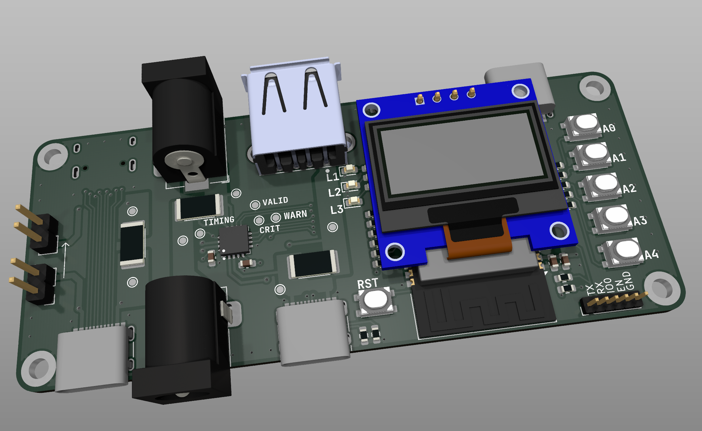

# tinyMeter

Current/voltage meter board for:
- USB-C passthrough with PD support
- USB-C - USB-A 5V rail 
- DC-Jack passthrough

ESP32-S3 MCU is powered from separate master USB-C port with USB communication enabled. MCU is communicating with INA3221 IC via I2C. Separate I2C lines are connected to SSD1306 display connector (GND, 3V3, SCL, SDA). MCU also connected to 5 user buttons for user interaction and 3 LEDs.

## PCB

Board is implemented as 4-layer PCB with [Signal/GND - GND - 3V3 - Signal/GND] stackup (theoretically can be shrinked to 2 layers). 

