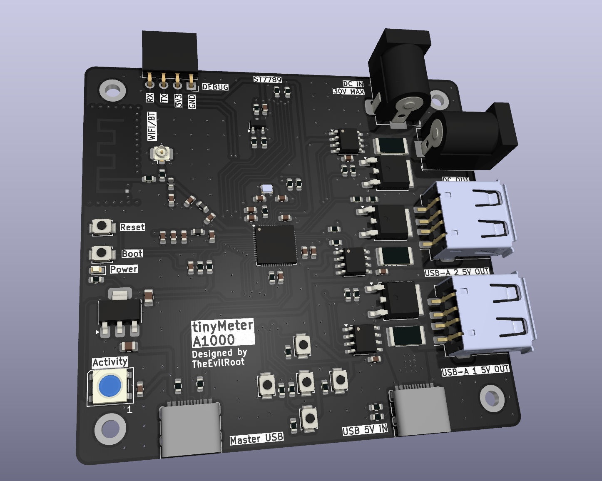

# tinyMeter

Current/voltage meter board for 5V and 12V rails.

Provides:
- two USB-A outputs at 5V from single USB-C input 5V@3A max.
- one DC Jack output from DC jack output, 30V max.

Board is powered from separate USB-C with data lines connected MCU.

3V3 rail is powered by AMS1117-3.3 LDO regulator from master USB-C VBUS.

Has ESP32-S3 SoC as a MCU with in-package PSRAM and Flash. WiFi/Bluetooth antenna is implemented on PCB.

Power meter capability is done using INA219 chips from TI and 25mOhm shunts on power rails. Each rails can also be turned on/off by MCU using 100N03A N-channel MOSFETs on each rail.

Board supports ST7789 display connection using 0.7mm pitch FPC connector. 

Cuurrent PCB looks like:

